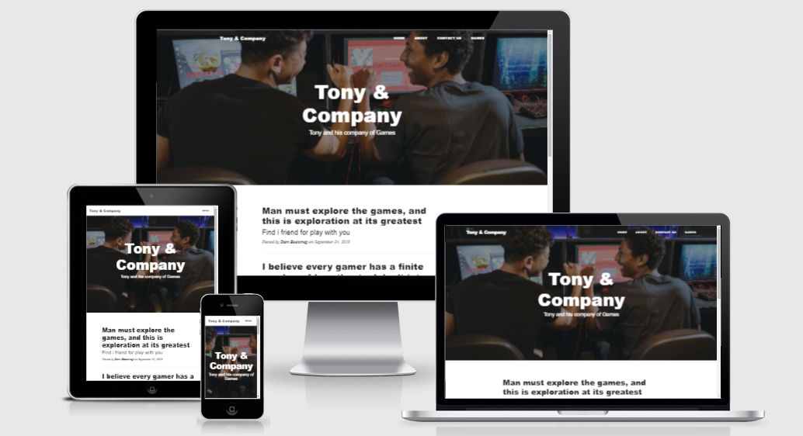

# [All About Game](https://game-finde.herokuapp.com/) - Milestone Project : Python - Code Institute



<p align=center>
<a href="https://game-finde.herokuapp.com/">Open App</a></p>

## Table of Content

- [**About**](#About)
  - [**Why This Project**](#Why-This-Project)
- [**UX**](#UX)
  - [**User Stories**](#User-Stories)
  - [**Research**](#Research)
  - [**Design**](#Design)
- [**Features**](#Features)
  - [**Functionality**](#Functionality)
  - [**Existing Feautures**](#Existing-Features)
  - [**Features Left To Implement**](#Features-Left-To-Implement)
- [**Technologies Used**](#Technologies-Used)
  - [**Languages**](#Languages)
  - [**Tools**](#Tools)
  - [**Libraries**](#Libraries)
  - [**Frameworks**](#Frameworks)
  - [**Hosting**](#Hosting)
- [**Testing**](#Testing)
  - [**Browsers**](#Browsers)
  - [**Devices**](#Devices)
  - [**Unresolved Bugs**](#Unresolved-Bugs)
  - [**Code Validation**](#Code-Validation)
- [**Deployment**](#Deployment)
  - [**Live App Link**](#Live-App-Link)
  - [**Repository Link**](#Repository-Link)
  - [**Running Code Locally**](#Running-Code-Locally)
- [**Credits**](#Credits)
  - [**Content**](#Content)
  - [**Acknowledgements**](#Acknowledgements)
  - [**Media**](#Media)
  - [**Disclaimer**](#Disclaimer) 

## About
This application is a blog and was created for users to get inspired and share anything related to games. In the and in the future I will be implementing content for the user to post their experiences and create add as many blog posts as they like for free!.

## Why This Project?
This application was created for my 3rd Milestone Project with Python for [Code Institute](https://codeinstitute.net/). I used Python and a flask.

## UX

### User Stories
* As a user, I want to read inspiring posts from the web application.
* As a user, I want to be able to search and find a post.

### Research
I researched tutorials with Python and Flask on Youtube and Udemy, to understand more how to create a application and I could get a clear idea of what functionality and design I wanted my web application to have, however most of this project's user authentication functionality was taken from [Code Institute's](https://codeinstitute.net/) task manager mini project.

### Design
I wanted a white color scheme for this project to give a clean look. For the background I used a white and I kept the color of the navbar, footer and buttons the same white color scheme. All forms have a white background with black text and icons.

## Features
### Existing Features
- **Flash Messages** - 
Based on the user interaction, flash messages are displayed at the top of the page right below the navbar. Flash messages let users know that their actions are successfully completed.

### Features Left To Implement 

- **Users Profile** -
In the future, I would like the Users Profile to display all their information, give the user the option of uploading a profile picture and the option of changing their information or password. Plus I would like to give them the option of editing or deleting their account.

- **Share**-
In the future, I would like to add a feature which allows the users to share their post with others on social media.

- **Pagination** -
In the future, I would like to add pagination in my app to break the content into seperate pages for a more user-friendly experience.

- **Back Button** - 
In the future, I would like to add a button that takes a user back to "Home" page when they are on the "View Post" page.

- **Flash Messages** - 
Currently, the flash messages remain on the page unless the user reloads the page. In the future, I would like to add duration time for the display.

**Register** -
 Users can create their own account for free by filling the form and providing a username, email address and password which are required and stored in the database. The Form cannot be submitted if the username already exists but can create multiple accounts with the same email address. The users passwords are hashed for security purposes.

- **Login** - 
The login form has a username and password field which if correctly filled the users can login in their account.

- **Logout** - 
Users can logout from their account by clicking "Logout" in the navbar. 

- **Users Profile** -
Users who are registered and logged in can visit their profile page.

- **Create Post** -
Users can click on "Create Post" link in the navbar and will be directed to a form that has to be filled in with post title, image (optional), and content in order to create a new post. When the user clicks on the "Create Post" button, they will be redirected to the home page where they will be able to see their new post.

- **Edit Post** -
If the users want to update their post, they can click on the "Edit" button which appears at the bottom of their post. Also when they click on the "View Post" button, the post will open in a seperate page where they will still have the option of updating their post. Once the "Edit" button is clicked, a form will display in a separate page with the title, image url and content already pre-filled. Then changes in the inputs can be made and updated by clicking on the "Update" button. In case the users change their mind on updating their post, there is a "Cancel" button which will redirect them to the home page. Users can only edit their post and not others.

- **Delete Post** -
If the users want to delete their post, they can click on the "Delete" button which appears at the bottom of their post. Also when they click on the "View Post" button, the post will open in a seperate page where they will still have the option of deleting their post. Once the "delete" button is clicked, a pop-up will appear with the message "Are you sure you want to delete this post?". Then the user has the option of deleting the post by clicking the "Delete" button or cancel with the "Cancel" button which will exit the pop-up. Users can only delete their post and not others.

- **View Post** -
On the bottom left of every post there is a "View Post" button which opens the post in a seperate page and displays the full post alone. Only the he user who created that post has the option of editing or deleting the post.

- **Game** -
Add game option for user to find friends to play any game.

## Technologies Used 

### Languages 
1. [HTML](https://en.wikipedia.org/wiki/HTML)

HTML was used in this project to keep up with the latest industry standards. 

2. [CSS](https://en.wikipedia.org/wiki/Cascading_Style_Sheets)

CSS was used for styling the content.

3. [JavaScript](https://en.wikipedia.org/wiki/JavaScript)

JavaScript was used to create the main functional logic of this app. 

4. [Python](https://en.wikipedia.org/wiki/Python_programming_language)

Python was used as the back-end programming language for this app.

5. [PHP](https://www.scriptcase.net/?gclid=CjwKCAjwsNiIBhBdEiwAJK4khmSfz-_RG_PObsGP4oyTx99t8bi3EYeiF1vTOxxeThr9aDxys-bZjxoCxA8QAvD_BwE)
PHP is a general-purpose scripting language geared towards web development.

### Tools 
1. [Git](https://git-scm.com/)

Git was used in this project for version control.

2. [Visual Studio Code](https://code.visualstudio.com/)

Visual Studio Code was used to develop this project.

3. [Dev Tools](https://developers.google.com/web/tools/chrome-devtools)

Chrome DevTools is a set of web developer tools built directly into the Google Chrome browser. DevTools can help you edit pages on-the-fly and diagnose problems quickly, which ultimately helps you build better websites, faster. Google Chrome's Dev Tools was used in the building process of this project.

### Libraries 
1. Icons were obtained from [Font Awesome](https://fontawesome.com/).

2. Fonts were taken from [Google Fonts](https://fonts.google.com/).

3. [Bootstrap](https://getbootstrap.com/) UI components help in constructing attractive, consistent, and functional web pages and web apps, while adhering to modern web design principles such as browser portability, device independence, and graceful degradation.
### Frameworks 
1. [jQuery](https://jquery.com/) is a fast, small, and feature-rich JavaScript library. It was used in this project to simplify the DOM.

2. [Flask](https://flask.palletsprojects.com/en/1.1.x/) is a micro web framework written in Python. 
### Hosting 
* [Heroku](https://www.heroku.com/) was used as the hosting platform to deploy this app.

## Testing

### Browsers
This web application was tested in the following browsers to ensure the web application is compatible and responsive.
 * Chrome
 * Mozilla
 * Safari
 * Opera 
 * Internet Explorer
### Devices
 This web application was tested in the following devices to ensure the web application is compatible and responsive.
 * IPhone 8 Plus
 * Huawei P30 Pro 
 * Huawei Mediapad T5
 * MacBook Pro
 ### Unresolved Bugs
No problems found as it is a simple site i found no bugs.
### Code Validation
The web application's HTML and CSS code has been tested in [W3C Validator](https://validator.w3.org/). The JavaScript code has been tested in [JS Hint](https://jshint.com/). Python syntax has been tested in [Pep8 Online Tool](http://pep8online.com/) and responsiveness was tested in [Resposinator](https://www.responsinator.com/), [Am I Responsive](http://ami.responsivedesign.is/) and [Mobile-Friendly Test](https://search.google.com/test/mobile-friendly).

## Deployment 

####  [Live App Link](https://game-finde.herokuapp.com/)
#### [Repository Link](https://github.com/Anthoni-Mathias/game_finder)

I used GitHub for my version control and Heroku to host the live version of my project. To deploy my website to Heroku, I used the following steps:

1. Created the app in Heroku.
2. Ran the `sudo snap install --classic heroku` command in the terminal window to install heroku in my local workspace.
3. Ran the `heroku login --interactive` command in the terminal window and entered my credentials to login to Heroku.
4. Added and committed the files to Git using the `git add .` and `git commit -m ""` commands in the terminal window.
5. Linked the Heroku app as the remote master branch using the following command in the terminal window:

    ```heroku git:remote -a <app-name>```

6. Created a requirements.txt file using the following command in the terminal window:

    ```sudo pip3 freeze --local > requirements.txt```

7. Created a Procfile using the following command in the terminal window:

    ```echo web: python <fileName.py> > Procfile```

8. Ran the `git push heroku master` command in the terminal window to push the app to Heroku.
9. Ran the `heroku: ps:scale web=1` command in the terminal window to run the app in Heroku.
10. Entered the following Config Var in Heroku:

I didn't need to upload the IP and PORT Config Vars in Heroku, as these were already present in my `app.py` file.

The app was successfully deployed to Heroku at this stage.

### Running Code Locally 
To run my code locally, users can download a local copy of my code to their desktop by completing the following steps:

1. Go to [my GitHub repository](https://github.com/Anthoni-Mathias/game_finder).
2. Click on 'Clone or download' under the repository name.
3. Copy the clone URL for the repository in the 'Clone with HTTPs section'.
4. Open 'Git Bash' in your local IDE.
5. Change the current working directory to the location where you want the cloned directory to be made.
6. Type `git clone`, then paste the URL you copied in Step 3:

    ```git clone https://github.com/USERNAME/REPOSITORY```

7. In the terminal, run the `pip3 install -r requirements.txt` command to install the requirements.txt file.
8. You should now be able to run the app locally using the `python3 app.py` command.

## Credits 

### Content
* Modal Structure HTML and JavaScript code was taken from [Start Bootstrap](https://startbootstrap.com/).
* Forms Structure was taken from [Bootstrap](https://getbootstrap.com/).
* NavBar HTML and JavaScript code was taken from [Start Bootstrap](https://startbootstrap.com/).

### Media 
* Background Image was taken from [Google Images](https://www.google.dk/imghp?hl=en&tab=wi&authuser=0&ogbl) .
* None of the post images belong to me. I have taken all images from different and random [Google](https://www.google.dk/imghp?hl=en&tab=wi&authuser=0&ogbl) searches.

### Acknowledgements
* Overall project and README file was inspired by [this](https://github.com/hebs87/cookbook-milestone-project-three) project.
* Most of this project's user authentication functionality was taken from [Code Institute's](https://codeinstitute.net/) task manager mini project.
* I got help on fixing errors and hints on how to solve problems from [Stack Overflow](https://stackoverflow.com/) and [Slack](https://slack.com/intl/en-dk/).

### Disclaimer
This project is for educational purposes only.